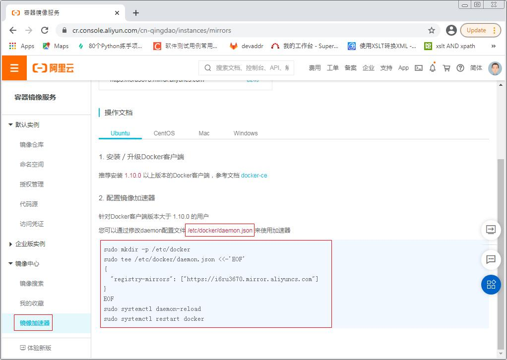
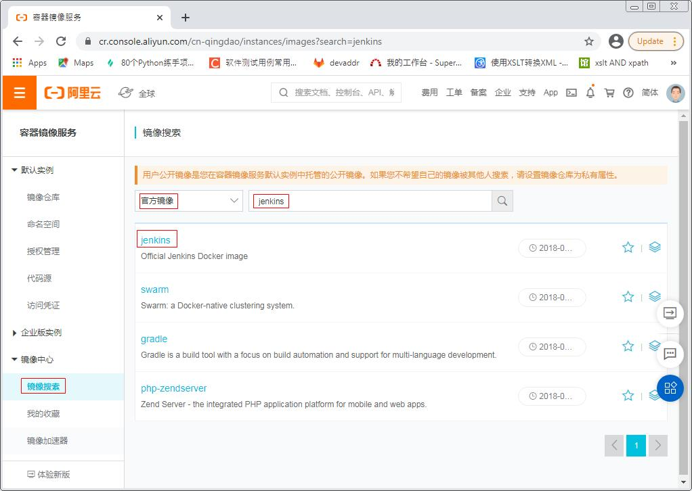
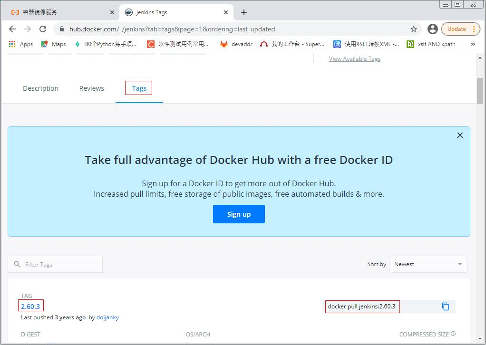
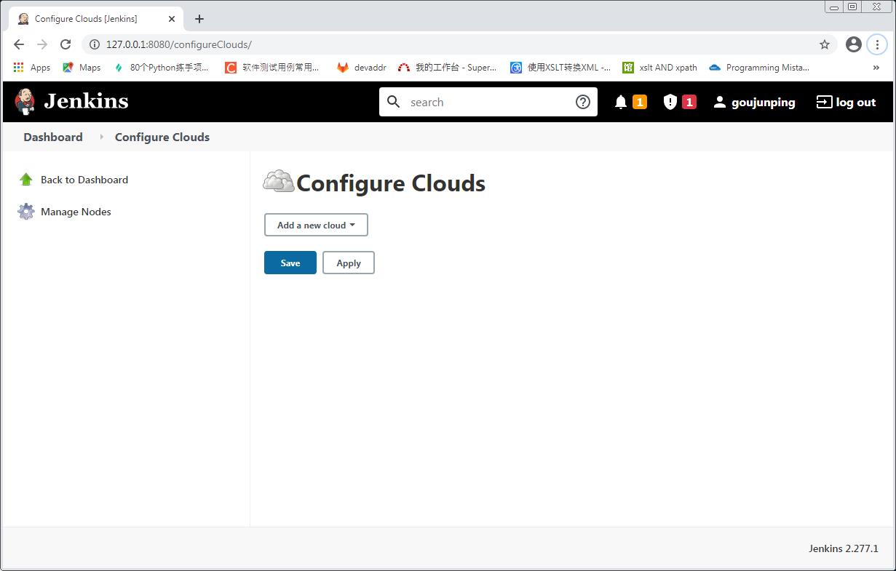
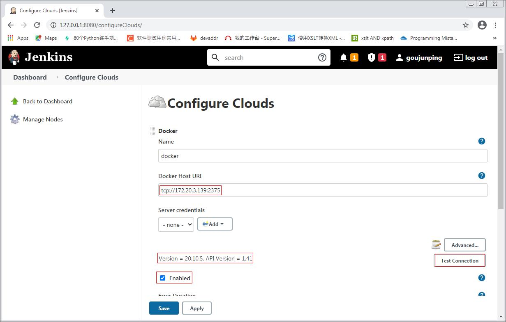
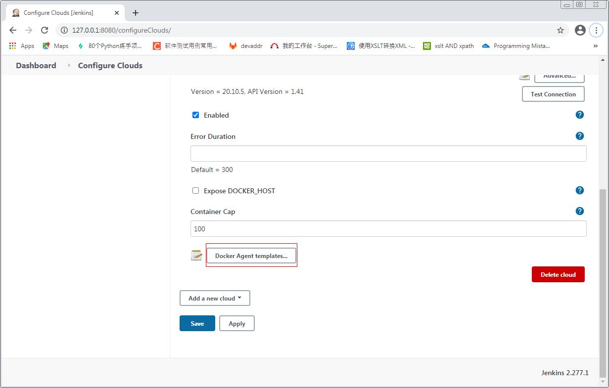
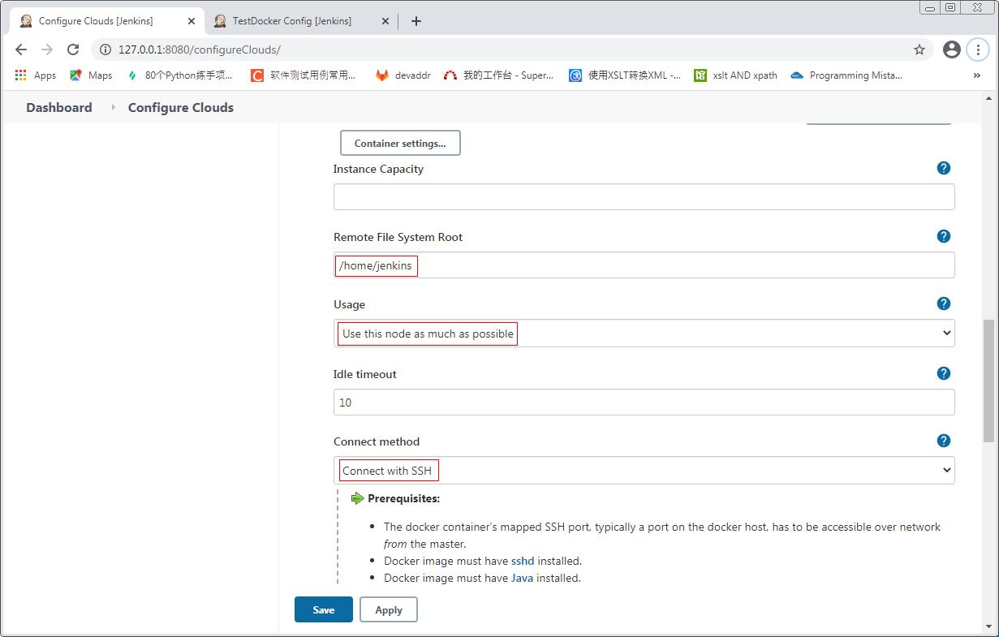
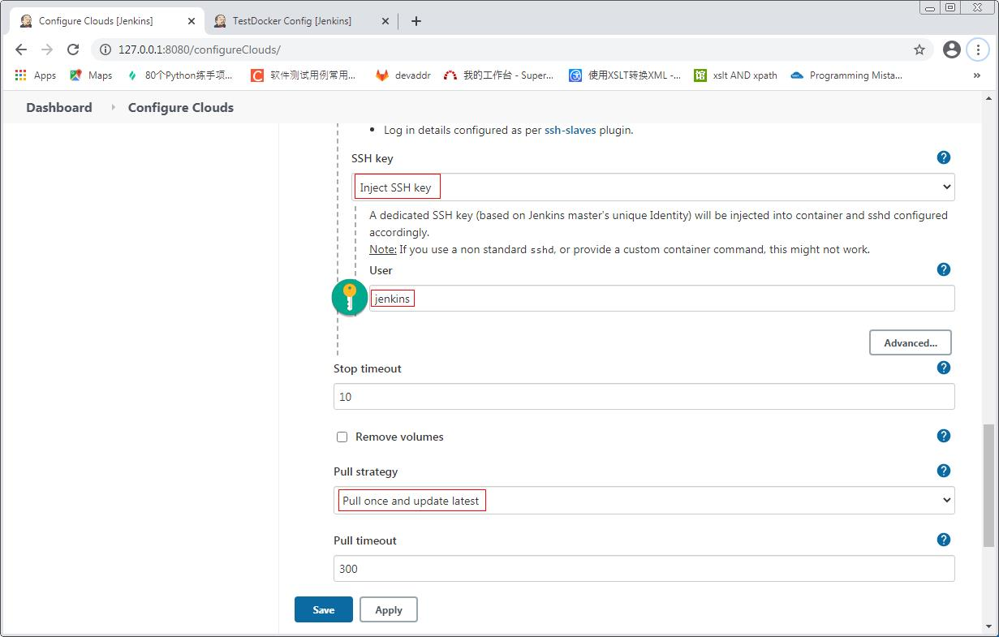

# Docker环境搭建

### Docker安装

系统: Centos7

1. 安装依赖库

    ```Shell
    yum install -y yum-utils device-mapper-persistent-data lvm2
    ```
  
2. 安装docker仓库

    ```Shell
    sudo yum-config-manager --add-repo https://download.docker.com/linux/centos/docker-ce.repo
    ```

3. 更新yum包索引

    ```Shell
    yum makecache fast
    ```

4. 安装最新版本的Docker CE

    ```Shell
    yum install docker-ce
    ```

5. Docker版本查看

    ```Shell
    [root@localhost opt]# docker version
    Client: Docker Engine - Community
     Version:           20.10.5
     API version:       1.41
     Go version:        go1.13.15
     Git commit:        55c4c88
     Built:             Tue Mar  2 20:33:55 2021
     OS/Arch:           linux/amd64
     Context:           default
     Experimental:      true

    Server: Docker Engine - Community
     Engine:
      Version:          20.10.5
      API version:      1.41 (minimum version 1.12)
      Go version:       go1.13.15
      Git commit:       363e9a8
      Built:            Tue Mar  2 20:32:17 2021
      OS/Arch:          linux/amd64
      Experimental:     false
     containerd:
      Version:          1.4.3
      GitCommit:        269548fa27e0089a8b8278fc4fc781d7f65a939b
     runc:
      Version:          1.0.0-rc92
      GitCommit:        ff819c7e9184c13b7c2607fe6c30ae19403a7aff
     docker-init:
      Version:          0.19.0
      GitCommit:        de40ad0
    [root@localhost opt]#
    ```

6. Docker卸载

    ```Shell
    [root@localhost ~]# yum remove docker docker-common docker-selinux docker-engine docker-ce-cli
    Loaded plugins: fastestmirror, langpacks
    No Match for argument: docker
    No Match for argument: docker-common
    No Match for argument: docker-engine
    Resolving Dependencies
    --> Running transaction check
    ---> Package container-selinux.noarch 2:2.119.2-1.911c772.el7_8 will be erased
    --> Processing Dependency: container-selinux >= 2:2.74 for package: containerd.io-1.4.4-3.1.el7.x86_64
    --> Processing Dependency: container-selinux >= 2:2.74 for package: 3:docker-ce-20.10.5-3.el7.x86_64
    --> Running transaction check
    ---> Package containerd.io.x86_64 0:1.4.4-3.1.el7 will be erased
    ---> Package docker-ce.x86_64 3:20.10.5-3.el7 will be erased
    --> Processing Dependency: docker-ce for package: docker-ce-rootless-extras-20.10.5-3.el7.x86_64
    --> Running transaction check
    ---> Package docker-ce-rootless-extras.x86_64 0:20.10.5-3.el7 will be erased
    --> Finished Dependency Resolution
    extras/7/x86_64                                                                                                                              | 2.9 kB  00:00:00
    mysql-connectors-community/x86_64                                                                                                            | 2.6 kB  00:00:00
    mysql-tools-community/x86_64                                                                                                                 | 2.6 kB  00:00:00
    mysql56-community/x86_64                                                                                                                     | 2.6 kB  00:00:00
    nux-dextop/x86_64                                                                                                                            | 2.9 kB  00:00:01
    updates/7/x86_64                                                                                                                             | 2.9 kB  00:00:00

    Dependencies Resolved

    ====================================================================================================================================================================
     Package                                       Arch                       Version                                       Repository                             Size
    ====================================================================================================================================================================
    Removing:
     container-selinux                             noarch                     2:2.119.2-1.911c772.el7_8                     @extras                                41 k
    Removing for dependencies:
     containerd.io                                 x86_64                     1.4.4-3.1.el7                                 @docker-ce-stable                     128 M
     docker-ce                                     x86_64                     3:20.10.5-3.el7                               @docker-ce-stable                     115 M
     docker-ce-rootless-extras                     x86_64                     20.10.5-3.el7                                 @docker-ce-stable                      24 M

    Transaction Summary
    ====================================================================================================================================================================
    Remove  1 Package (+3 Dependent packages)

    Installed size: 268 M
    Is this ok [y/N]: y
    Downloading packages:
    Running transaction check
    Running transaction test
    Transaction test succeeded
    Running transaction
      Erasing    : docker-ce-rootless-extras-20.10.5-3.el7.x86_64                                                                                                   1/4
      Erasing    : 3:docker-ce-20.10.5-3.el7.x86_64                                                                                                                 2/4
      Erasing    : containerd.io-1.4.4-3.1.el7.x86_64                                                                                                               3/4
      Erasing    : 2:container-selinux-2.119.2-1.911c772.el7_8.noarch                                                                                               4/4
      Verifying  : containerd.io-1.4.4-3.1.el7.x86_64                                                                                                               1/4
      Verifying  : 3:docker-ce-20.10.5-3.el7.x86_64                                                                                                                 2/4
      Verifying  : docker-ce-rootless-extras-20.10.5-3.el7.x86_64                                                                                                   3/4
      Verifying  : 2:container-selinux-2.119.2-1.911c772.el7_8.noarch                                                                                               4/4

    Removed:
      container-selinux.noarch 2:2.119.2-1.911c772.el7_8

    Dependency Removed:
      containerd.io.x86_64 0:1.4.4-3.1.el7               docker-ce.x86_64 3:20.10.5-3.el7               docker-ce-rootless-extras.x86_64 0:20.10.5-3.el7

    Complete!
    [root@localhost ~]# rm -rf /var/lib/docker
    [root@localhost ~]# rm -f /etc/docker/daemon.json
    [root@localhost ~]# rm -f /usr/lib/systemd/system/docker.service
    ```

### Docker配置

1. 加速器配置: 阿里云为例, https://cr.console.aliyun.com/cn-qingdao/instances/mirrors

    

2. 下载镜像: 以Jenkins镜像为例

    镜像搜索:
    
    
    
    因为Jenkins镜像没有latest版本, 所以在pull的时候需要跟tag号
    
    

    ```Shell
    [root@localhost opt]# docker pull jenkins:2.60.3
    2.60.3: Pulling from library/jenkins
    55cbf04beb70: Pull complete
    1607093a898c: Pull complete
    9a8ea045c926: Pull complete
    d4eee24d4dac: Pull complete
    c58988e753d7: Pull complete
    794a04897db9: Pull complete
    70fcfa476f73: Pull complete
    0539c80a02be: Pull complete
    54fefc6dcf80: Pull complete
    911bc90e47a8: Pull complete
    38430d93efed: Pull complete
    7e46ccda148a: Pull complete
    c0cbcb5ac747: Pull complete
    35ade7a86a8e: Pull complete
    aa433a6a56b1: Pull complete
    841c1dd38d62: Pull complete
    b865dcb08714: Pull complete
    5a3779030005: Pull complete
    12b47c68955c: Pull complete
    1322ea3e7bfd: Pull complete
    Digest: sha256:eeb4850eb65f2d92500e421b430ed1ec58a7ac909e91f518926e02473904f668
    Status: Downloaded newer image for jenkins:2.60.3
    docker.io/library/jenkins:2.60.3
    [root@localhost opt]#
    [root@localhost opt]# docker images
    REPOSITORY    TAG       IMAGE ID       CREATED         SIZE
    hello-world   latest    bf756fb1ae65   14 months ago   13.3kB
    jenkins       2.60.3    cd14cecfdb3a   2 years ago     696MB
    [root@localhost opt]#
    ```

### Docker常用命令

1. **docker images**: 查看已安装的docker镜像

2. **docker image rm <imageID>**: 删除镜像

3. **docker pull [OPTIONS] NAME[:TAG|@DIGEST]**: 获取镜像

4. **docker search**: 从仓库搜索镜像

5. **docker exec –it <containerID> bash**: 进入docker容器内部

6. **docker run**: 运行docker镜像

7. **docker ps**: 查看运行容器进程

8. **docker run –d**: 在后台运行docker镜像

9. **docker run –p 3306:3306**: 端口映射

10. **docker stop <containerID>**：停止正在运行的容器

### 将容器中的数据目录挂载到宿主机

以Jenkins镜像为例

1. 启动Jenkins镜像

    ```Shell
    [root@localhost local]# docker run -d --name jenkins -p 8080:8080 -p 50000:50000 jenkins:2.60.3
    825cd4485f22ac775f224dbbc4cab69b59b79cb812ed511bdb318f6ab7f9233f
    [root@localhost local]#
    ```
    
2. 将容器中的/var/jenkins_home/userContent目录复制到宿主机中/usr/local/jenkins/userContent

    ```Shell
    [root@localhost local]# mkdir /usr/local/jenkins
    [root@localhost local]# docker cp jenkins:/var/jenkins_home/userContent /usr/local/jenkins/userContent
    [root@localhost local]# ls -al /usr/local/jenkins/
    total 0
    drwxr-xr-x   3 root root  25 Mar 10 10:20 .
    drwxr-xr-x. 13 root root 146 Mar 10 10:19 ..
    drwxr-xr-x   2 root root  24 Mar 10 10:14 userContent
    [root@localhost local]# 
    ```

3. 停止前面运行的容器

    ```Shell
    [root@localhost local]# docker ps
    CONTAINER ID   IMAGE            COMMAND                  CREATED         STATUS         PORTS                                              NAMES
    825cd4485f22   jenkins:2.60.3   "/bin/tini -- /usr/l…"   8 minutes ago   Up 8 minutes   0.0.0.0:8080->8080/tcp, 0.0.0.0:50000->50000/tcp   jenkins
    [root@localhost local]# docker stop 825cd4485f22
    825cd4485f22
    [root@localhost local]#
    ```

4. 再次运行容器, 添加挂载命令

    ```Shell
    [root@localhost local]# docker run -d --name jenkins -p 8080:8080 -p 50000:50000 -v /usr/local/jenkins/userContent:/var/jenkins_home/userContent jenkins:2.60.3
    docker: Error response from daemon: Conflict. The container name "/jenkins" is already in use by container "825cd4485f22ac775f224dbbc4cab69b59b79cb812ed511bdb318f6ab7f9233f". You have to remove (or rename) that container to be able to reuse that name.
    See 'docker run --help'.
    [root@localhost local]# docker rm -f jenkins
    jenkins
    [root@localhost local]#
    [root@localhost local]#
    [root@localhost local]# docker run -d --name jenkins -p 8080:8080 -p 50000:50000 -v /usr/local/jenkins/userContent:/var/jenkins_home/userContent jenkins:2.60.3
    17755738c01e84d00ac25eeee06582111e52f8a2f283deb068aa92b827fd7535
    [root@localhost local]#
    ```

5. 确认挂载成功, 修改宿主机的/usr/local/jenkins/userContent/目录中的readme.txt文件, 查看容器中文件是否被修改 

    ```Shell
    [root@localhost local]# cd /usr/local/jenkins/userContent/
    [root@localhost userContent]# ls -al
    total 4
    drwxr-xr-x 2 root root 24 Mar 10 10:14 .
    drwxr-xr-x 3 root root 25 Mar 10 10:20 ..
    -rw-r--r-- 1 root root 82 Mar 10 10:14 readme.txt
    [root@localhost userContent]# cat readme.txt
    Files in this directory will be served under your http://yourjenkins/userContent/
    [root@localhost userContent]# echo ============= >> readme.txt
    [root@localhost userContent]# cat readme.txt
    Files in this directory will be served under your http://yourjenkins/userContent/
    =============
    [root@localhost userContent]# docker ps
    CONTAINER ID   IMAGE            COMMAND                  CREATED              STATUS              PORTS                                              NAMES
    17755738c01e   jenkins:2.60.3   "/bin/tini -- /usr/l…"   About a minute ago   Up About a minute   0.0.0.0:8080->8080/tcp, 0.0.0.0:50000->50000/tcp   jenkins
    [root@localhost userContent]# docker exec -it 17755738c01e bash
    jenkins@17755738c01e:/$ cd /var/jenkins_home/userContent/
    jenkins@17755738c01e:~/userContent$ ls -al
    total 8
    drwxr-xr-x  2 root    root      24 Mar 10 02:14 .
    drwxr-xr-x 13 jenkins jenkins 4096 Mar 10 02:27 ..
    -rw-r--r--  1 root    root      96 Mar 10 02:27 readme.txt
    jenkins@17755738c01e:~/userContent$ cat readme.txt
    Files in this directory will be served under your http://yourjenkins/userContent/
    =============
    jenkins@17755738c01e:~/userContent$
    ```
    
### 使用registry镜像创建本地仓库

1. 拉取registry镜像

    ```Shell
    [root@localhost ~]# docker pull registry
    Using default tag: latest
    latest: Pulling from library/registry
    0a6724ff3fcd: Pull complete
    d550a247d74f: Pull complete
    1a938458ca36: Pull complete
    acd758c36fc9: Pull complete
    9af6d68b484a: Pull complete
    Digest: sha256:d5459fcb27aecc752520df4b492b08358a1912fcdfa454f7d2101d4b09991daa
    Status: Downloaded newer image for registry:latest
    docker.io/library/registry:latest
    [root@localhost ~]#
    [root@localhost ~]# docker images
    REPOSITORY   TAG       IMAGE ID       CREATED        SIZE
    registry     latest    678dfa38fcfa   2 months ago   26.2MB
    ```

2. 在/usr/lib/systemd/system/docker.service文件的ExecStart字段中增加--insecure-registry \<ip\>:5000配置, 其中\<ip\>为当前系统的IP地址

    ```Shell
    [root@localhost ~]# cat /usr/lib/systemd/system/docker.service
    [Unit]
    Description=Docker Application Container Engine
    Documentation=https://docs.docker.com
    After=network-online.target firewalld.service containerd.service
    Wants=network-online.target
    Requires=docker.socket containerd.service

    [Service]
    Type=notify
    # the default is not to use systemd for cgroups because the delegate issues still
    # exists and systemd currently does not support the cgroup feature set required
    # for containers run by docker
    ExecStart=/usr/bin/dockerd -H fd:// --containerd=/run/containerd/containerd.sock --insecure-registry 172.20.3.139:5000
    ExecReload=/bin/kill -s HUP $MAINPID
    TimeoutSec=0
    RestartSec=2
    Restart=always

    # Note that StartLimit* options were moved from "Service" to "Unit" in systemd 229.
    # Both the old, and new location are accepted by systemd 229 and up, so using the old location
    # to make them work for either version of systemd.
    StartLimitBurst=3

    # Note that StartLimitInterval was renamed to StartLimitIntervalSec in systemd 230.
    # Both the old, and new name are accepted by systemd 230 and up, so using the old name to make
    # this option work for either version of systemd.
    StartLimitInterval=60s

    # Having non-zero Limit*s causes performance problems due to accounting overhead
    # in the kernel. We recommend using cgroups to do container-local accounting.
    LimitNOFILE=infinity
    LimitNPROC=infinity
    LimitCORE=infinity

    # Comment TasksMax if your systemd version does not support it.
    # Only systemd 226 and above support this option.
    TasksMax=infinity

    # set delegate yes so that systemd does not reset the cgroups of docker containers
    Delegate=yes

    # kill only the docker process, not all processes in the cgroup
    KillMode=process
    OOMScoreAdjust=-500

    [Install]
    WantedBy=multi-user.target
    [root@localhost ~]#
    ```

3. 重启docker服务

    ```Shell
    [root@localhost ~]# systemctl daemon-reload
    [root@localhost ~]# systemctl restart docker
    ```

4. 运行容器

    ```Shell
    [root@localhost ~]# mkdir /usr/local/registry
    [root@localhost ~]#
    [root@localhost ~]# docker run -d -p 5000:5000 -v /usr/local/registry:/var/lib/registry registry
    2e58f8e33125403ea814bd6b3f67912d7512bb673ed3c552953059b75ac4c6f1
    [root@localhost ~]#
    [root@localhost ~]# docker ps
    CONTAINER ID   IMAGE      COMMAND                  CREATED         STATUS         PORTS                    NAMES
    2e58f8e33125   registry   "/entrypoint.sh /etc…"   4 seconds ago   Up 3 seconds   0.0.0.0:5000->5000/tcp   agitated_kalam
    ```

5. 拉取一个Jenkins容器

    ```Shell
    [root@localhost ~]# docker pull jenkins:2.60.3
    2.60.3: Pulling from library/jenkins
    55cbf04beb70: Pull complete
    1607093a898c: Pull complete
    9a8ea045c926: Pull complete
    d4eee24d4dac: Pull complete
    c58988e753d7: Pull complete
    794a04897db9: Pull complete
    70fcfa476f73: Pull complete
    0539c80a02be: Pull complete
    54fefc6dcf80: Pull complete
    911bc90e47a8: Pull complete
    38430d93efed: Pull complete
    7e46ccda148a: Pull complete
    c0cbcb5ac747: Pull complete
    35ade7a86a8e: Pull complete
    aa433a6a56b1: Pull complete
    841c1dd38d62: Pull complete
    b865dcb08714: Pull complete
    5a3779030005: Pull complete
    12b47c68955c: Pull complete
    1322ea3e7bfd: Pull complete
    Digest: sha256:eeb4850eb65f2d92500e421b430ed1ec58a7ac909e91f518926e02473904f668
    Status: Downloaded newer image for jenkins:2.60.3
    docker.io/library/jenkins:2.60.3
    [root@localhost ~]#
    [root@localhost ~]# docker images
    REPOSITORY   TAG       IMAGE ID       CREATED        SIZE
    registry     latest    678dfa38fcfa   2 months ago   26.2MB
    jenkins      2.60.3    cd14cecfdb3a   2 years ago    696MB
    [root@localhost ~]#
    ```

6. 在本地host上, 重命名镜像, 上传到本地仓库中, 添加新的tag, 使之与registry相匹配

    ```Shell
    [root@localhost ~]# docker tag jenkins:2.60.3 172.20.3.139:5000/jenkins_test
    [root@localhost ~]# docker images
    REPOSITORY                       TAG       IMAGE ID       CREATED        SIZE
    registry                         latest    678dfa38fcfa   2 months ago   26.2MB
    172.20.3.139:5000/jenkins_test   latest    cd14cecfdb3a   2 years ago    696MB
    jenkins                          2.60.3    cd14cecfdb3a   2 years ago    696MB
    [root@localhost ~]#
    [root@localhost ~]# docker push 172.20.3.139:5000/jenkins_test
    Using default tag: latest
    The push refers to repository [172.20.3.139:5000/jenkins_test]
    0577e068c587: Pushed
    b1891bf16fa7: Pushed
    37c1d818eb0b: Pushed
    d51e4482f53a: Pushed
    ceed640cbb93: Pushed
    047f9c957a2e: Pushed
    1db731634011: Pushed
    a0775f499ef1: Pushed
    c19390bb619a: Pushed
    6ff38243bfb8: Pushed
    9fe468dbb76f: Pushed
    571ae0d6961a: Pushed
    518c9e7eb326: Pushed
    c3ebb2aa7787: Pushed
    9c2e8b91bfa8: Pushed
    c477b6c8ca45: Pushed
    fa0c3f992cbd: Pushed
    ce6466f43b11: Pushed
    719d45669b35: Pushed
    3b10514a95be: Pushed
    latest: digest: sha256:0de43cde2c4b864a8e4a84bbd9958e47c5d851319f118203303d040b0a74f159 size: 4501
    [root@localhost ~]# 
    ```

7. 删除本地镜像, 重新从本地仓库拉取

    ```Shell
    [root@localhost ~]# docker rmi 172.20.3.139:5000/jenkins_test:latest
    Untagged: 172.20.3.139:5000/jenkins_test:latest
    Untagged: 172.20.3.139:5000/jenkins_test@sha256:0de43cde2c4b864a8e4a84bbd9958e47c5d851319f118203303d040b0a74f159
    [root@localhost ~]#
    [root@localhost ~]# docker images
    REPOSITORY   TAG       IMAGE ID       CREATED        SIZE
    registry     latest    678dfa38fcfa   2 months ago   26.2MB
    jenkins      2.60.3    cd14cecfdb3a   2 years ago    696MB
    [root@localhost ~]#
    [root@localhost ~]# docker pull 172.20.3.139:5000/jenkins_test
    Using default tag: latest
    latest: Pulling from jenkins_test
    Digest: sha256:0de43cde2c4b864a8e4a84bbd9958e47c5d851319f118203303d040b0a74f159
    Status: Downloaded newer image for 172.20.3.139:5000/jenkins_test:latest
    172.20.3.139:5000/jenkins_test:latest
    [root@localhost ~]# docker images
    REPOSITORY                       TAG       IMAGE ID       CREATED        SIZE
    registry                         latest    678dfa38fcfa   2 months ago   26.2MB
    172.20.3.139:5000/jenkins_test   latest    cd14cecfdb3a   2 years ago    696MB
    jenkins                          2.60.3    cd14cecfdb3a   2 years ago    696MB
    [root@localhost ~]#
    ```

8. 可以在浏览器中访问http://172.20.3.139:5000/v2/_catalog查看镜像上传日志

    

### Jenkins中的slave使用docker

1. 配置docker服务器

    在/usr/lib/systemd/system/docker.service文件中的ExecStart增加"-H tcp://0.0.0.0:2375"
    
    ```Shell
    ExecStart=/usr/bin/dockerd -H tcp://0.0.0.0:2375 -H fd:// --containerd=/run/containerd/containerd.sock
    ```

    然后重启服务
    
    ```Shell
    systemctl daemon-reload
    systemctl restart docker
    ```

2. jenkins安装Docker plugin插件

3. Manage Jenkins -> Configure System -> Cloud 配置docker slave

    
    
4. Add a new cloud -> Docker

    

5. 配置docker cloud

    - Docker Host URI: 配置为tcp://172.20.3.139:2375, 其中的IP为docker服务器的IP, 端口为步骤1中配置的端口
    
    - 点击Test Connection: 测试是否能连接成功, 连接成功后会显示docker服务器的版本
    
    - Enable需要勾选

    

    - 其他配置使用默认值
    
    - 点击Docker Agent templates... -> Add Docker Template
    
    

    - Labels: 配置docker salve的标签, 在配置Job的时候需要指定这个label
    
    - Enable需要勾选
    
    - Name: 随便指定
    
    - Docker Image: 镜像名称jenkins/ssh-slave:latest, 第一次连接的时候, 如果服务器中没有这个镜像, 则会自动去仓库下载, 目前该镜像测试能正常运行

    

    - Remote File System Root: 设置slave中工作根目录为/home/jenkins
    
    - Usage: 选择Use this node as much as possible
    
    - Connect method: 选择连接方式为Connect with SSH

    
    
    - SSH key: 选择Inject SSH key
    
    - User: 设置为jenkins, 目前测试该用户名能正常连接
    
    - Pull strategy: pull镜像策略选择Pull once and update latest
    
    

    - 点击Advanced... -> 配置JavaPath为/usr/local/openjdk-8/bin/java, 如果不配置Java路径, 则在连接docker的时候会默认去PATH环境变量的路径去查找, 如果查找不到则会连接失败
    
    
    
    


Docker官方链接: https://docs.docker.com/
