# ESXI 6.7 安装

- 服务器安装:

去官网下载iso包, 刻录到U盘, 然后从U盘启动即可

    * No Network Adapters

    以前安装6.0的时候没有出现过任何错误, 但是最近安装新版本(6.7)的时候, 出现了以下错误, 提示没有网络适配器
    
    可以通过以下方式解决(当前是以win7 x64环境):

        + 安装 VMware PowerCLI

        下载地址: http://down.whsir.com/downloads/VMware-PowerCLI-6.5.0-4624819.exe
        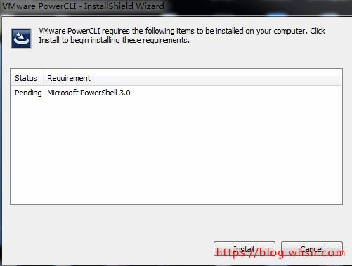
        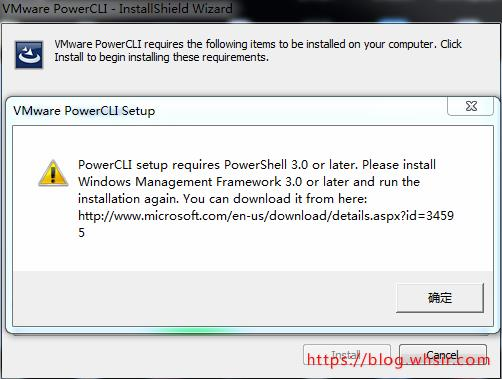

        可能会弹出提示需要下载PowerShell3.0, 下载地址：https://download.microsoft.com/download/E/7/6/E76850B8-DA6E-4FF5-8CCE-A24FC513FD16/Windows6.1-KB2506143-x64.msu

        如果还有其他依赖缺失，请自行下载
        
        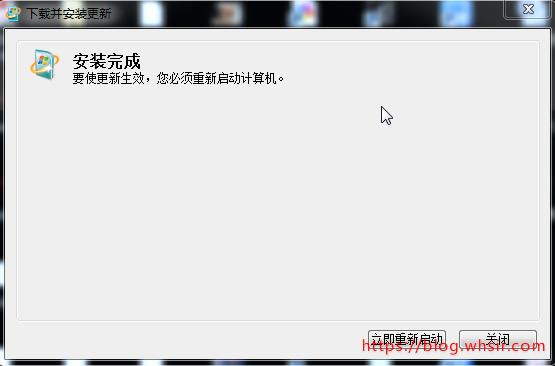

        重启系统后重新运行VMware-PowerCLI-6.5.0安装
        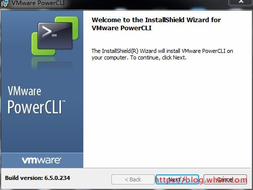
        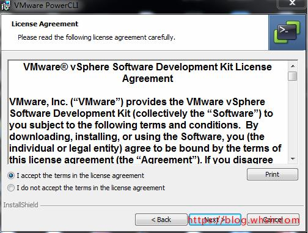
        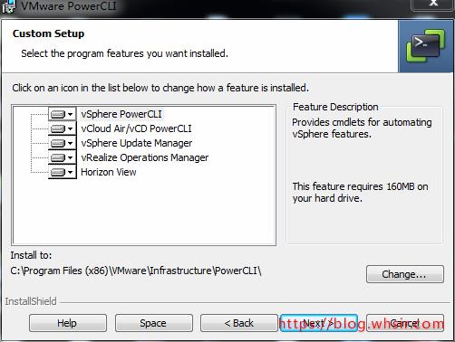
        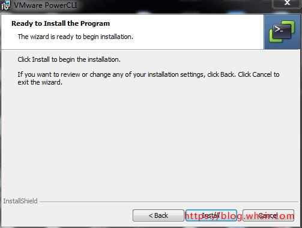
        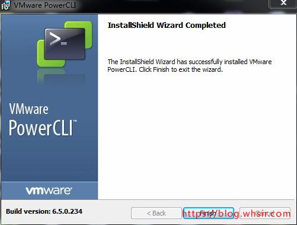

        安装完成后电脑桌面会生成一个VMware PowerCLI，运行后如果看到以下报错
        

        解决办法：开始-所有程序-附件-Windows PowerShell(管理员身份运行), 输入以下命令
        ```Shell
        Set-ExecutionPolicy Unrestricted
        ```
        

        然后重新启动VMware PowerCLI会有个默认的设置, 直接回车即可, 第二次启动后可以看到如下画面, 此时VMware PowerCLI安装完成
        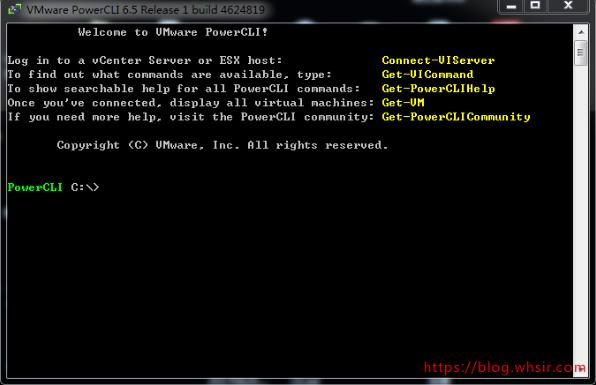

        + 下载 http://down.whsir.com/downloads/ESXi-Customizer-PS-v2.6.0.ps1

        + 连网打包ISO:

        打开VMware PowerCLI, 进入ESXi-Customizer-PS-v2.6.0.ps1文件所在目录, 执行如下命令:
        ```Shell
        .\\ESXi-Customizer-PS-v2.6.0.ps1  -v67  -vft  -load  net55-r8168,sata-xahci
        ```
        参数解释：
    　　-v67    指定是VMware ESXI为 6.7版本
    　　-vft      在线连接到V-Front在线仓库下载驱动到VMware ESXI.ISO镜像包
    　　-load   指定要添加到VMware ESXI.ISO镜像的驱动
    　　Sata-xahci   常用的SATA控制器
    
        详细命令参数可以查看此网址： https://www.v-front.de/p/esxi-customizer-ps.html#download
        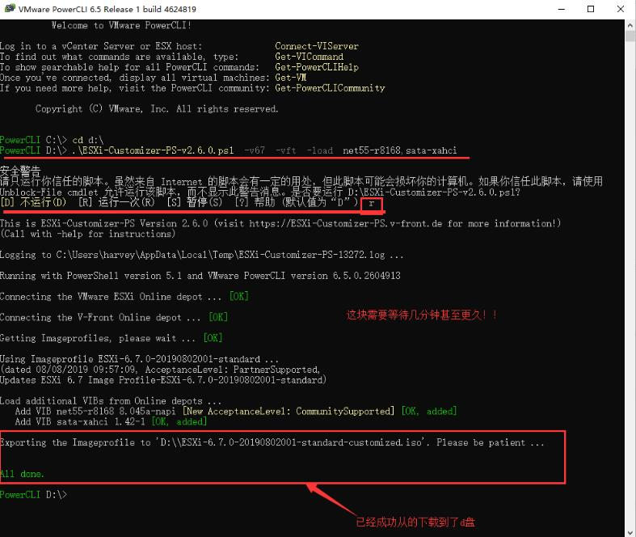

        等执行结束后就可以看到当前目录下有个ESXi-6.7.0-20190802001-standard-customized.iso镜像文件了

        + 离线打包ISO, 如果连网导报失败则可以使用该方法:
        下载Esxi6.7: http://down.whsir.com/downloads/ESXi670-201905001.zip
        下载net55-r8168网卡驱动: http://down.whsir.com/downloads/net55-r8168-8.045a-napi.x86_64.vib; 对于其他网卡可以在https://vibsdepot.v-front.de/wiki/index.php/List_of_currently_available_ESXi_packages中查找
        net55-r8168驱动支持网卡型号（Realtek RTL8111B / RTL8168B / RTL8111/RTL8168 / RTL8111C / RTL8111CP / RTL8111D(L) / RTL8168C / RTL8111DP / RTL8111E / RTL8168E / RTL8111F / RTL8411 / RTL8111G / RTL8111GUS / RTL8411B(N) / RTL8118AS / D-Link DGE-528T）
        
        注意：下载的驱动是vib格式。
        将ESXi-Customizer-PS-v2.6.0.ps1和ESXi670-201905001.zip放到当前目录下, 然后在当前目录下创建whsir目录, 将net55-r8168-8.045a-napi.x86_64.vib放到whsir目录中, 然后在VMware PowerCLI执行以下命令：
        ```Shell
        .\\ESXi-Customizer-PS-v2.6.0.ps1 -izip .\\ESXi670-201905001.zip -pkgDir whsir\\
        ```

        注意：打包时会自动在whsir文件夹内查找vib的驱动，生成的ESXI6.7.iso镜像会在当前目录下

        如果一切正常，可看到以下内容
        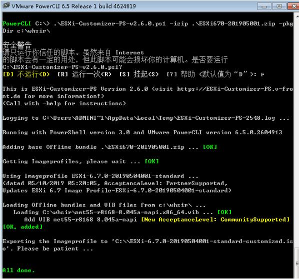

    * 系统内存强制要求大于4G

    放入光盘或U盘，开始安装，一直普通流程到Welcome画面，按ALT+F1
    登陆界面账号：root 密码为空
    ```Shell
    cd /usr/lib/vmware/weasel/util
    rm upgrade_precheck .pyc #文件可能不存在
    mv upgrade_precheck .py upgrade_precheck .py.old
    cp upgrade_precheck .py.old upgrade_precheck .py #如果直接把这个文件备份.old
    chmod 666 upgrade_precheck .py　　#增加权限后在原文件修改提示权限不允许
    vi upgrade_precheck .py
    ```
    编辑文本界面中查找 MEM_MIN #vi 搜索命令是斜杠 /
    MEM_MIN_SIZE= (4*1024) 改成 MEM_MIN_SIZE= (2*1024)
    wq! 强制保存退出
    ```Shell
    ps -c |grep weasel #不结束进程，直接适用ALT+F2貌似无效
    kill -9 [进程ID] #
    ```
    此时正常情况下会跳回欢迎界面，如不跳回按ALT+F2返回继续安装

- USB 直通配置(passthrough)

以下是ESXI 6.0的基础上操作的

    * 硬件要支持vt-d模式, 可以在BIOS中打开vt-d

    华硕BIOS中的intel vt-d为Intel 虚拟化技术选项, 可以通过在BIOS中的System Agent Configuration选项开启VT。具体设置步骤如下：

    * 开机后按“DEL”或“F2”进入BIOS
    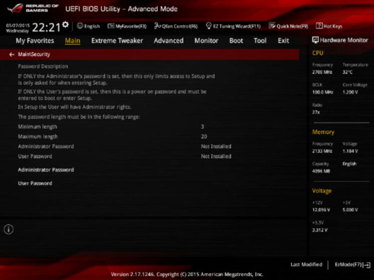
    
    * 在Advanced选项页中找到System Agent Configuration并选择进入
    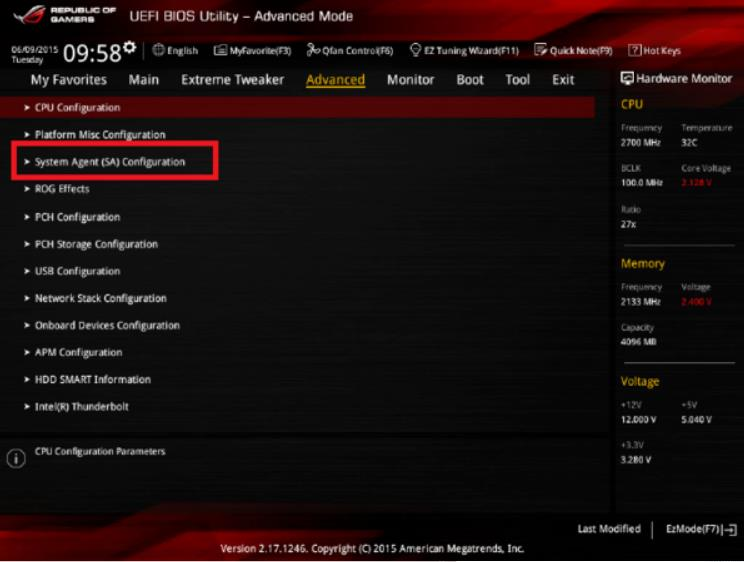
    
    * 进入System Agent Configuration后将VT-D选项设置为Enabled即可
    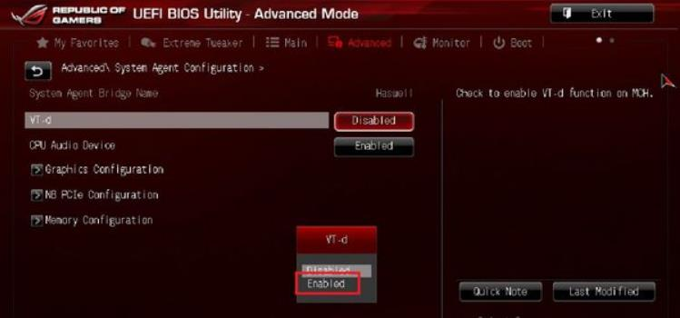
    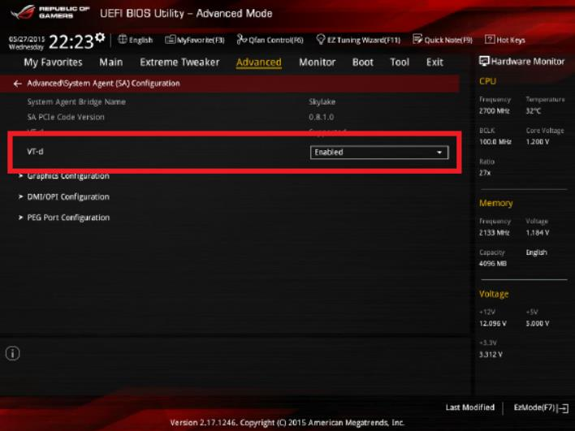

    * 设置完成后点击F10键即可保存BIOS中的设置，机器会自动重启。
    
- 使用vSphere Client登录服务器

点击主机 -> 配置 -> 硬件 -> 高级设置, 如果现实当前主机不支持直通, 则可能是硬件不支持, 或者BIOS中没有打开vt-d
然后点击右侧的编辑 -> 在弹出的界面中选择要直通的设备 -> 确定即可
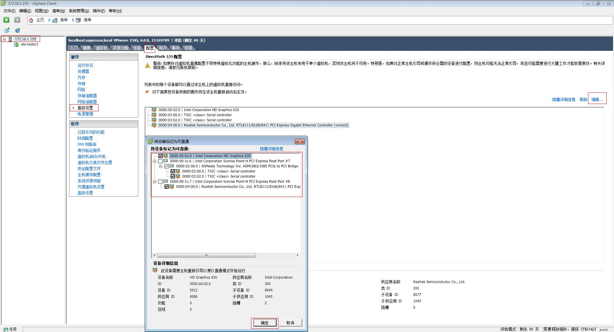

然后选择虚拟机 -> 编辑虚拟机设置 -> 硬件 -> 添加 -> usb设备; 点击下一步就会出现刚才插入的设备, 选中对应的设备添加即可, 然后就可以在虚拟机中看到对应的USB
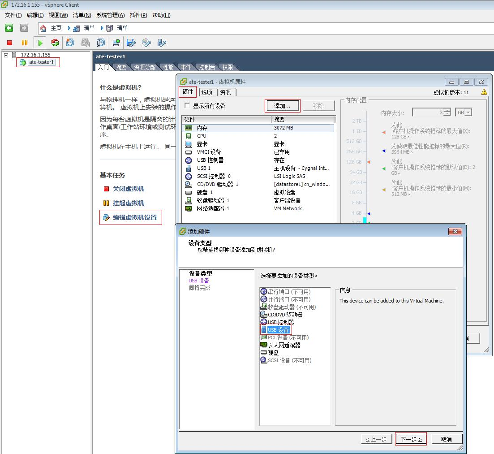

- 在直通配置的时候, 如果选中了Intel Corporation HD Graphics 630这个显卡设备, 则在重启服务器的时候, 就卡在了vmkapi-v2_2_0_0_vmkernel_shim loaded successfully步骤

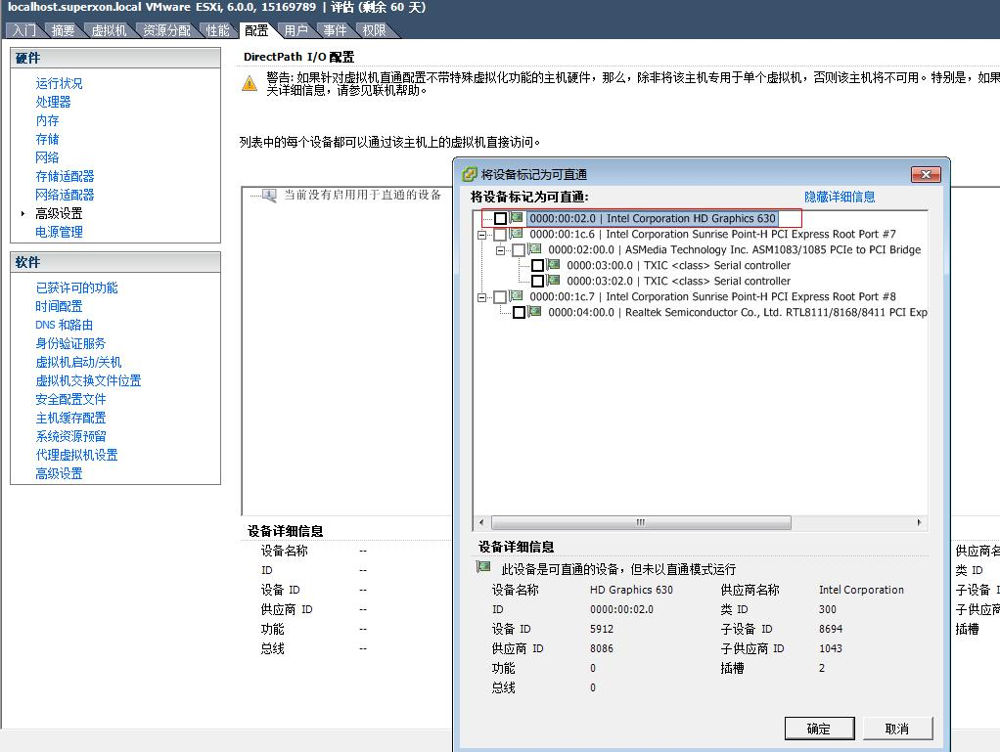

- 在直通配置的时候, 如果选中了网卡, 则启动后出现以下错误: No compatible network adapter found. Please consult the product's Hardware Compatibility Guide(HCG) for a list of supported adapters.
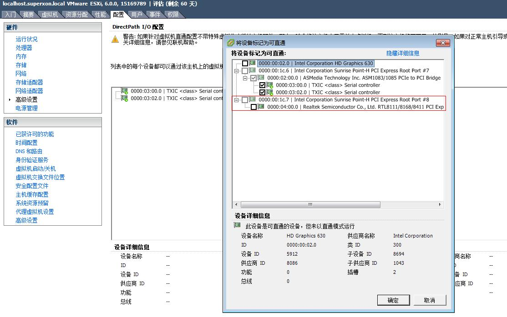

# 虚拟机克隆

- ssh登录到ESXI服务器

```Shell
#创建要克隆的虚拟机的目录
mkdir /vmfs/volumes/datastore1/ate-tester2
#将已有的虚拟机ate-tester1.vmdk克隆到ate-tester2
vmkfstools -i /vmfs/volumes/datastore1/ate-tester1/ate-tester1.vmdk /vmfs/volumes/datastore1/ate-tester2/ate-tester2.vmdk -d thin
```

参考:
https://vibsdepot.v-front.de/wiki/index.php/Welcome
http://www.mamicode.com/info-detail-2754061.html
https://blog.whsir.com/post-4462.html
https://www.cnblogs.com/Sunzz/p/11438066.html
