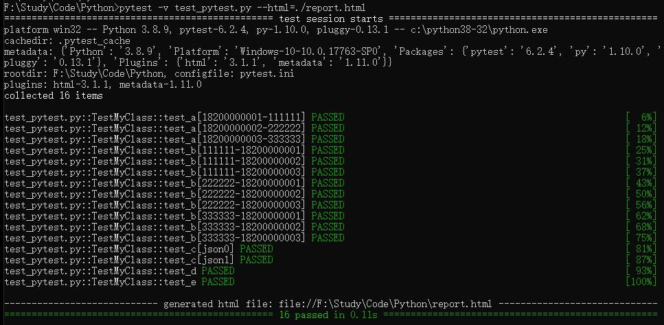

# pytest和Allure框架

### 介绍:

pytest是一个非常成熟的全功能的python测试框架, 主要有以下几个特点:

1. 简单灵活, 容易上手; 支持参数化; 测试用例的skip和xfail处理;

2. 能够支持简单的单元测试和复杂的功能测试, 还可以用来做selenium/appium等自动化测试, 接口自动化测试(pytest+requests);

3. pytest具有很多第三方插件, 并且可以自定义扩展, 比较好用的如pytest-allure(完美html测试报告生成), pytest-xdist(多CPU分发)等;

4. 可以很好的和jenkins集成

pytest官方文档:

https://docs.pytest.org/en/latest/contents.html


### pytest及其他第三方库的安装

```Shell
pip install –U pytest
pip install sugar
pip install pytest-rerunfailures
pip install pytest-xdist
pip install pytest-assume
pip install pytest-html
pytest –h
```

### 编写规则

1. 测试文件以test_开头或者以_test.py结尾

2. 测试类以Test开头，并且不能带有init方法

3. 测试函数以test_开头

4. 断言使用基本的assert即可

### 使用及接口

1. 命令行使用及参数

**pytest** 运行当前目录下的所有用例

**pytest test_mod.py** 运行模块test_mod.py下的所有用例

**pytest somepath** 运行某个路径下的所有用例

**pytest -k stringexpr** 只运行名字匹配stringexpr的类或者方法, 例如"-k 'test_method or test_other'"匹配名字中包含test_method或者test_other的类或方法; "-k 'not test_method'"匹配名字中不包含test_method的类或者方法; 这个匹配是区分大小写的

**pytest test_mod.py::test_func** 只运行test_mod.py模块中的test_func方法

**-v** 用于显示每个测试函数的执行结果

**-q** 只显示整体测试结果

**-s** 用于显示测试函数中print()函数输出

**-x, --exitfirst** 第一个失败或者出错的用例后立即退出

2. 装饰器\@pytest.fixture的作用域有四种

    - **\@pytest.fixture(scope='function')** 每个test都运行, 默认是function的scope
    
    - **\@pytest.fixture(scope='class')** 每个class的所有test只运行一次
    
    - **\@pytest.fixture(scope='module')** 每个module的所有test只运行一次
    
    - **\@pytest.fixture(scope='session')** 每个session只运行一次

3. setup和teardown

    - 模块级别的setup和teardown: 只调用一次, 只针对模块中的函数有用, 模块中的类方法没用
    
    ```Python
    def setup_module(module):
        """ setup any state specific to the execution of the given module."""

    def teardown_module(module):
        """teardown any state that was previously setup with a setup_module
        method.
        """
    ```
    
    - 类级别的setup和teardown: 只在类的前后调用一次
    
    ```Python
    @classmethod
    def setup_class(cls):
        """setup any state specific to the execution of the given class (which
        usually contains tests).
        """

    @classmethod
    def teardown_class(cls):
        """teardown any state that was previously setup with a call to
        setup_class.
        """
    ```

    - 方法级别的setup和teardown: 类中的每个方法都会调用一次
    
    ```Python
    def setup_method(self, method):
        """setup any state tied to the execution of the given method in a
        class.  setup_method is invoked for every test method of a class.
        """

    def teardown_method(self, method):
        """teardown any state that was previously setup with a setup_method
        call.
        """
    ```

    - 函数级别的setup和teardown: 不在类中的每个函数都会调用一次
    
    ```Python
    def setup_function(function):
        """setup any state tied to the execution of the given function.
        Invoked for every test function in the module.
        """

    def teardown_function(function):
        """teardown any state that was previously setup with a setup_function
        call.
        """
    ```

4. 通过pytest.mark对用例打标签

标签需要先在pytest.ini文件中注册, 比如这里注册了两个标签smoke和demo

```ini
[pytest]
markers =
    smoke: marks tests as smoke (deselect with '-m "not smoke"')
    serial
    
    demo: marks tests as demo (deselect with '-m "not demo"')
    serial
```

然后就可以在用例中使用该标签了

```Python
# file_name: test_pytest.py
import pytest

class TestMyClass():
    @pytest.mark.smoke
    @pytest.mark.demo
    def test_a(self):
        print("------->test_a start<-------")
        print("-------->test_a end<--------")
        assert 1

    @pytest.mark.smoke
    def test_b(self):
        print("------->test_b start<-------")
        print("-------->test_b end<--------")
        assert 1

    @pytest.mark.demo
    def test_c(self):
        print("------->test_c start<-------")
        print("-------->test_c end<--------")
        assert 1


if __name__ == '__main__':
    pytest.main(["-s","test_pytest.py"])
```

在命令行增加参数'-m "smoke"'只跑test_a和test_b, '-m "demo"'只跑test_a和test_c, '-m "smoke and demo"'只跑test_a, '-m "smoke or demo"'跑所有用例

具体命令:

```Shell
pytest -v -m "demo or smoke" test_pytest.py --html=./report.html
```

5. 装饰器**\@pytest.mark.parametrize**用来实现测试用例参数化

该装饰器有两个参数, 第一个参数为字符串, 对应与函数的参数名, 多个参数名用逗号分开; 第二个参数为list, list的每个元素都是一个元组, 元组里的每个元素顺序跟参数名的顺序一一对应; 如果参数名只有一个, 则list中也只有一个元组, 此时可以省略元组, 直接用将所有元素写入list中.

传一个参数\@pytest.mark.parametrize('参数名', \[参数_data\[0\], 参数_data\[1\]\])进行参数化

传两个参数\@pytest.mark.parametrize('参数名1, 参数名2', \[(参数1_data\[0\], 参数2_data\[0\]), (参数1_data\[1\], 参数2_data\[1\])])进行参数化

也可以传入json格式

```Python
# file_name: test_pytest.py
import pytest

json=({"username":"alex","password":"111111"},{"username":"rongrong","password":"222222"})

class TestMyClass():
    @pytest.mark.parametrize("user,pwd",[("18200000001",111111),("18200000002",222222),("18200000003",333333)])
    def test_a(self, user, pwd):
        print("------->test_a start<-------")
        print('User: {}, Password: {}'.format(user, pwd))
        print("-------->test_a end<--------")
        assert 1

    @pytest.mark.parametrize("user", ["18200000001", "18200000002", "18200000003"])
    @pytest.mark.parametrize("pwd", [111111, 222222, 333333])
    def test_b(self, user, pwd):
        print("------->test_b start<-------")
        print('User: {}, Password: {}'.format(user, pwd))
        print("-------->test_b end<--------")
        assert 1

    @pytest.mark.parametrize("json", json)
    def test_c(self, json):
        print("------->test_c start<-------")
        print(json)
        print('username : {}, password : {}'.format(json["username"], json["password"]))
        print("-------->test_c end<--------")
        assert 1


if __name__ == '__main__':
    pytest.main(["-s","test_pytest.py"])
```

该例中test_a会有3个用例, test_b会有9个用例, test_c会有2个用例



参考:

https://blog.51cto.com/u_15009374/2555751

6. 日志

首先在pytest.ini中配置日志格式

```ini
log_cli = true
log_cli_level = DEBUG
log_cli_date_format = %Y-%m-%d-%H-%M-%S
log_cli_format = %(asctime)s - %(filename)s - %(module)s - %(funcName)s - %(lineno)d - %(levelname)s - %(message)s
log_file = test.log
log_file_level = DEBUG
log_file_date_format = %Y-%m-%d-%H-%M-%S
log_file_format = %(asctime)s - %(filename)s - %(module)s - %(funcName)s - %(lineno)d - %(levelname)s - %(message)s
```

然后在需要打印日志的文件中调用

```Python
import logging

logger = logging.getLogger(__name__)

logger.info("logging information")
```

参考:

https://www.cnblogs.com/poloyy/category/1690628.html?page=2

### allure测试报告框架

一. 安装

    Python库:

    ```Shell
    pip install allure-pytest
    ```

    命令工具:

    官方地址: https://github.com/allure-framework/allure2/releases

    目前最新版本是2.13.10, 但是这个版本可能有问题, 生成报告后, 用任何浏览器打开都是空白页, 在加载javascript的时候都会报错: allure is not defined; 切换到2.13.9则OK
    
    Windows需要将allure-2.13.9\bin的绝对路径加入到PATH环境变量中

    这两个工具都需要安装

二. 使用

1. 在测试脚本中 ...


2. 在执行pytest的时候指定--alluredir reports参数, 会将allure日志保存到reports目录中


3. 执行命令allure generate ./reports -c -o ./allure-reports --clean生成html报告, 这样打开index.html的时候没有数据; 需要通过服务的方式打开(命令:allure serve ./reports), 这样会自动打开默认浏览器并显示结果


三. 在将allure集成到Jenkins中


